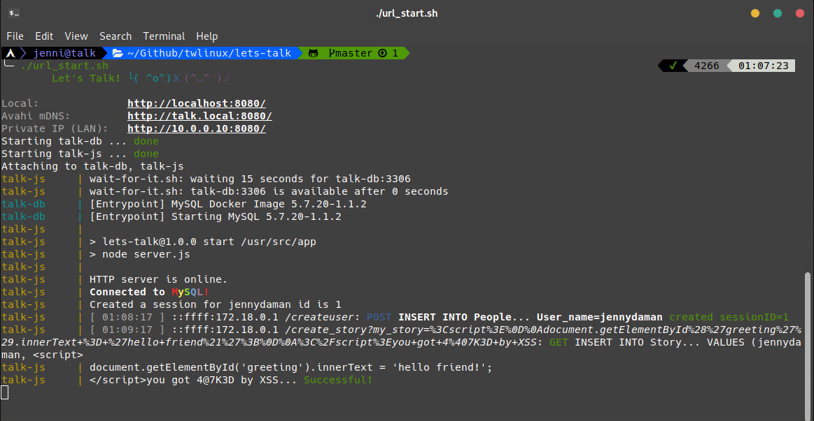

# Let's Talk!


[](https://github.com/twlinux/lets-talk/blob/master/LICENSE)

*Let's Talk!* is a quick n' dirty web app that demonstrates simple SQL and JavaScript vulnerabilities.


## Web Stack

| Layer      | Solution                                                                        |
|------------|---------------------------------------------------------------------------------|
| server     | [node.js + express](https://expressjs.com/)                                     |
| database   | [Docker + MySQL](https://hub.docker.com/r/mysql/mysql-server/)                  |
| front-end  | [materialize-css](http://materializecss.com/) + [jQuery](https://jquery.com/) |

## Deployment

Install [docker](https://www.docker.com/what-container) (v17.04.0+) and a recent version of [docker-compose](https://github.com/docker/compose) (v1.12.0+, the one in Ubuntu artful will not work). On **Windows**, simply install [**Docker Toolbox**](https://docs.docker.com/toolbox/toolbox_install_windows/). This is convenient, because *Toolbox* will install everything you need: the Docker engine, docker-compose, git, and the MINGW shell.

`PORT` must be specified as a shell variable before running `docker-compose up`. (The default HTTP port is 80)

The wrapper script `lets_talk.sh` makes it easier to launch this application. It should be cross-compatible with all UNIX environments, such as MacOS, Linux, and fake Windows shells like GIT shell (MinGW).

```bash
chmod +x lets_talk.sh           # executable permission
./lets_talk.sh -h               # show usage flags
./lets_talk.sh                  # connect to host port 8080
sudo PORT=80 ./lets_talk.sh     # OR connect to host port 80
```

If you've DOSed the site with XSS, you can reset the database by deleting the `letstalk_database` docker volume. This is facilitated with the script: `./lets_talk.sh -d`.



## Vulnerabilities

*(that I know of)*

Reports are found as multi-line comments in server.js.

```bash
awk '/- HACK/,/\*\//{printf("%-4s%s\n", NR":", $0)}' server/server.js | less -p '^.*HACK.*$'
```

More examples at https://twlinux.github.io/

- [JavaScript XSS Payloads](https://twlinux.github.io/2018-02-06-js-payloads/)
- [Cookie Theft](https://twlinux.github.io/2018-02-18-hijacking/)
- [Cross-site Request Forgery](https://twlinux.github.io/2018-02-19-csrf/)

Related Wikipedia articles

- [Cross-site Scripting (XSS)](https://www.owasp.org/index.php/Cross-site_Scripting_(XSS))
- [SQL Injection (SQLi)](https://www.owasp.org/index.php/SQL_Injection)
- [Cross-Site Request Forgery (CSRF)](https://www.owasp.org/index.php/Cross-Site_Request_Forgery_(CSRF))
- [Man in the Middle (MitM)](https://en.wikipedia.org/wiki/Man-in-the-middle_attack)

## Too easy?

- https://google-gruyere.appspot.com/
- https://github.com/ethicalhack3r/DVWA
- https://information.rapid7.com/metasploitable-download.html


